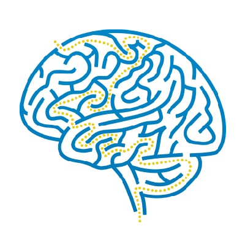

  

<h2 align="center">Connecting Dots Forever</h2>

	
 "CDF" / "cd forever" 

	<a href="https://github.com/orgs/Connecting-Dots-Forever/discussions" target="_blank"> Discussions Page </a>
	|
	<a href="https://discord.gg/8xM7gZ2AU6" target="_blank"> Discord Server </a>

# 🤔: What we do / Why ??

1. We all Create Projects together on this github orgs
2. We Do Meet on every Friday-Night : ( 9 pm )
3. Share thinks we do on discord
   - Code / Tech related stuff
   - which we should share & talk
   - to improve Ourself and Surrounding

<!-- Variables -->
[discussions-page]: https://github.com/orgs/Connecting-Dots-Forever/discussions
[discord-server]: https://discord.gg/8xM7gZ2AU6
